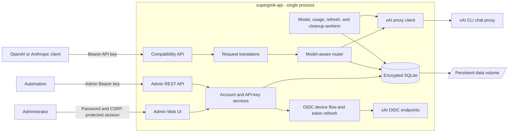

# supergrok-api

`supergrok-api` is a single-process Go service that exposes OpenAI- and Anthropic-compatible HTTP APIs backed by xAI accounts authenticated through the xAI device flow. It includes an administrator Web UI for connecting accounts, checking model and usage state, and issuing downstream API keys.

> This project uses xAI account credentials and the xAI CLI proxy. Review the applicable xAI terms before deploying it. It is not the official xAI API or an official billing client.

## Features

- OpenAI-compatible Models, Chat Completions, and Responses endpoints.
- Anthropic-compatible Messages and token-counting endpoints.
- Streaming responses over server-sent events (SSE).
- Required xAI search integration on generated upstream requests.
- Multiple xAI accounts with model-aware round-robin routing, cooldowns, and failover.
- Encrypted SQLite persistence for account credentials, OAuth state, usage snapshots, and response sessions.
- Server-rendered administrator UI with password authentication and CSRF protection.
- Named downstream API keys with one-time plaintext display and immediate revocation.
- Health and readiness endpoints for container platforms.

## Architecture



The service deliberately runs as one replica. SQLite state, routing cooldowns, and background workers are not coordinated across multiple instances.

## HTTP endpoints

| Endpoint | Authentication | Purpose |
| --- | --- | --- |
| `GET /healthz` | None | Process health |
| `GET /readyz` | None | Readiness; requires a routable default model |
| `GET /v1/models` | Downstream API key | OpenAI-compatible model list |
| `POST /v1/chat/completions` | Downstream API key | OpenAI Chat Completions |
| `POST /v1/responses` | Downstream API key | OpenAI Responses |
| `POST /v1/messages` | Downstream API key | Anthropic Messages |
| `POST /v1/messages/count_tokens` | Downstream API key | Anthropic token counting |
| `/admin/` | Administrator password/session | Administrator Web UI |
| `/admin/api/v1/*` | Administrator API key | Administrator REST API |

OpenAI-compatible endpoints accept `Authorization: Bearer <downstream-key>`. Anthropic-compatible endpoints also accept `x-api-key: <downstream-key>`.

## Required secrets

| Variable | Requirement |
| --- | --- |
| `SUPERGROK_MASTER_KEY` | Exactly 32 random bytes encoded with standard base64. Back it up; changing it makes encrypted persisted data unreadable. |
| `SUPERGROK_ADMIN_PASSWORD` | Password for `/admin/login`. |
| `SUPERGROK_ADMIN_API_KEY` | Bearer token for `/admin/api/v1/*`; separate from downstream client keys. |

Each secret may instead be supplied through a file by setting the corresponding `_FILE` variable, such as `SUPERGROK_MASTER_KEY_FILE`.

## Deploy with Docker Compose

Requirements: Docker with Compose v2, OpenSSL, and a local clone of this repository.

### 1. Create deployment variables

Run these commands from the repository root:

```sh
export SUPERGROK_VERSION=local
export SUPERGROK_COMMIT="$(git rev-parse --short HEAD)"
export SUPERGROK_BUILD_DATE="$(date -u +%Y-%m-%dT%H:%M:%SZ)"
export SUPERGROK_MASTER_KEY="$(openssl rand -base64 32)"
export SUPERGROK_ADMIN_PASSWORD="$(openssl rand -base64 24)"
export SUPERGROK_ADMIN_API_KEY="$(openssl rand -hex 32)"
```

Store the three secret values in a password manager before continuing. To preserve the same values across restarts and rebuilds, put all six variables in a local `.env` file that is not committed, or export them again in the shell that runs Compose.

### 2. Start the service

```sh
docker compose up --build -d
```

The Compose configuration:

- exposes the service only on `127.0.0.1:8080`;
- stores SQLite data in the named `supergrok-data` volume mounted at `/data`;
- restarts the service unless explicitly stopped; and
- checks `http://127.0.0.1:8080/healthz` inside the container.

Check the deployment:

```sh
docker compose ps
curl --fail http://127.0.0.1:8080/healthz
```

### 3. Configure the service

1. Open <http://127.0.0.1:8080/admin/login>.
2. Sign in with `SUPERGROK_ADMIN_PASSWORD`.
3. Connect at least one xAI account through the device authorization flow.
4. Open **API keys**, create a downstream key, and copy it immediately. Its plaintext is shown once.
5. Wait for `/readyz` to return HTTP `200` before sending generation requests.

Example request:

```sh
curl http://127.0.0.1:8080/v1/chat/completions \
  -H "Authorization: Bearer $SUPERGROK_CLIENT_API_KEY" \
  -H 'Content-Type: application/json' \
  -d '{
    "model": "grok",
    "messages": [{"role": "user", "content": "What happened in AI today?"}]
  }'
```

### Public access

The Compose port is loopback-only by design. Put an HTTPS reverse proxy such as Caddy, nginx, or Traefik in front of the service instead of changing it to an unrestricted public bind without firewall and TLS controls.

If the proxy sends `X-Forwarded-Proto`, add only that proxy's IP address or CIDR to `server.trusted_proxies` in a YAML configuration file and start the container with `--config <path>`. Forwarded headers from untrusted peers are ignored.

### Operations

```sh
# Follow logs
docker compose logs -f supergrok-api

# Restart without deleting persisted data
docker compose restart supergrok-api

# Stop the service and retain the named volume
docker compose down
```

Do not run `docker compose down -v` unless permanently deleting accounts, keys, sessions, usage state, and other SQLite data is intentional.

## Deploy on Railway

The repository uses separate container definitions: root `Dockerfile` for Docker Compose and `Dockerfile.railway` for Railway, plus `railway.json` and `deploy/railway.yaml`. Railway builds its dedicated Dockerfile without a Docker `VOLUME` instruction, listens on Railway's injected `PORT`, mounts persistent state through a Railway Volume at `/data`, checks `/healthz`, and runs exactly one replica.

### 1. Create the service

Choose either method:

- **Dashboard:** create a Railway project, select **Deploy from GitHub repo**, and choose this repository.
- **Railway CLI:** link an existing Railway project and run `railway up` from the repository root. `railway up` deploys application source; `railway deploy` is for templates.

`railway.json` explicitly selects `Dockerfile.railway` and supplies the start command and deployment settings; Railway storage is configured with a Railway Volume rather than Dockerfile `VOLUME` metadata.

### 2. Add a persistent volume

Attach one Railway volume to the service and set its mount path to:

```text
/data
```

This is required. The service stores its SQLite database and encrypted state there. Do not use an ephemeral path, and do not scale the service above one replica.

### 3. Set service variables

In the Railway service's **Variables** tab, add:

```text
SUPERGROK_MASTER_KEY=<base64-encoded 32-byte key>
SUPERGROK_ADMIN_PASSWORD=<strong administrator password>
SUPERGROK_ADMIN_API_KEY=<strong administrator bearer token>
```

Generate suitable values locally:

```sh
openssl rand -base64 32
openssl rand -base64 24
openssl rand -hex 32
```

Keep `SUPERGROK_MASTER_KEY` stable for the lifetime of the volume and back it up outside Railway. The Docker build metadata arguments are optional on Railway because `Dockerfile.railway` provides safe defaults.

### 4. Deploy and expose the service

1. Trigger a deployment or run `railway up`.
2. In **Settings → Networking**, generate a Railway domain or attach a custom domain.
3. Confirm `https://<your-domain>/healthz` returns HTTP `200`.
4. Open `https://<your-domain>/admin/login`, connect an xAI account, and create a downstream API key.
5. Confirm `https://<your-domain>/readyz` returns HTTP `200`.

`deploy/railway.yaml` trusts Railway proxy peers in `100.0.0.0/8`, allowing secure administrator cookies when Railway terminates HTTPS and forwards `X-Forwarded-Proto: https`. Do not copy that trusted-proxy range to unrelated hosting environments.

Railway references:

- [Deploying with the Railway CLI](https://docs.railway.com/cli/deploying)
- [Dockerfile builds](https://docs.railway.com/builds/dockerfiles)
- [Service variables](https://docs.railway.com/variables)
- [Persistent volumes](https://docs.railway.com/volumes)
- [Start commands](https://docs.railway.com/deployments/start-command)

## Run from source

Requirements: Go 1.26 and OpenSSL.

```sh
export SUPERGROK_MASTER_KEY="$(openssl rand -base64 32)"
export SUPERGROK_ADMIN_PASSWORD="$(openssl rand -base64 24)"
export SUPERGROK_ADMIN_API_KEY="$(openssl rand -hex 32)"
go run ./cmd/supergrok-api serve
```

Defaults are `127.0.0.1:8080` and `./data`. Optional CLI overrides:

```text
supergrok-api serve [--config path] [--listen address] [--data-dir path]
supergrok-api login [--config path] [--listen address] [--data-dir path]
supergrok-api version
```

A YAML file can override server, upstream, OAuth, model, limit, usage, and retention settings. Unknown YAML fields and invalid values fail closed.

## Security and persistence notes

- Keep `/data` persistent and private. Back it up, and retain `SUPERGROK_MASTER_KEY` securely in a separate secret store.
- Use HTTPS for every non-loopback deployment, especially the administrator UI.
- Keep the administrator API key separate from downstream API keys.
- Downstream API keys are stored as hashes; account credentials and sensitive state are encrypted before SQLite persistence.
- A fresh process is healthy before it is ready. Readiness requires at least one enabled, authenticated account that can serve the configured default model.
- The service has no multi-instance coordination. Run one process against one data directory.

## License

MIT. See [LICENSE](LICENSE) and [THIRD_PARTY_NOTICES](THIRD_PARTY_NOTICES).
