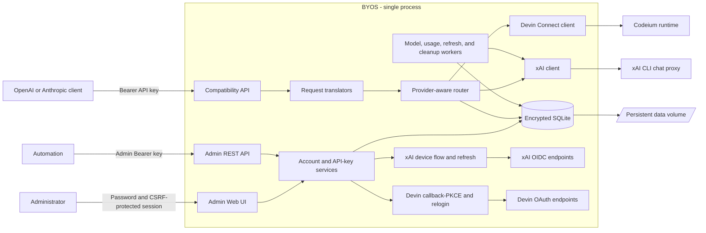

# BYOS

BYOS (Bring Your Own Subscription) is a single-process Go service that exposes OpenAI- and Anthropic-compatible HTTP APIs backed by xAI and Devin accounts. xAI accounts authenticate through the xAI device flow; Devin accounts authenticate through a browser callback OAuth flow. It includes an administrator Web UI for connecting accounts, checking model and usage state, and issuing downstream API keys.

> This project uses xAI account credentials, the xAI CLI proxy, and Devin/Codeium session credentials. Review the applicable xAI and Devin terms before deploying it. It is not the official xAI or Devin API or an official billing client.

## Features

- OpenAI-compatible Models, Chat Completions, and Responses endpoints.
- Anthropic-compatible Messages and token-counting endpoints.
- Streaming responses over server-sent events (SSE).
- Two provider backends with provider-aware routing, cooldowns, and failover:
  - **xAI** owns `grok` (alias of `grok-4.5`) and `grok-4.5`; xAI alone injects the mandatory `x_search` tool and maps explicit `tool_choice:"none"` to `"auto"`.
  - **Devin** owns `kimi-k2-7`, `glm-5-2`, and `swe-1-6-slow`; Devin preserves canonical `none`, `auto`, and selected tool choices and receives no injected search tool.
- Multiple accounts per provider with model-aware round-robin routing, cooldowns, and failover confined to the resolved provider.
- xAI device-flow login and Devin callback-PKCE login through the admin Web UI, Admin REST, and `byos login --provider`.
- Encrypted SQLite persistence for account credentials, OAuth state, usage snapshots, and response sessions.
- Server-rendered administrator UI with password authentication and CSRF protection.
- Named downstream API keys with one-time plaintext display and immediate revocation.
- Health and readiness endpoints for container platforms.

## Architecture



The service deliberately runs as one replica. SQLite state, routing cooldowns, and background workers are not coordinated across multiple instances.

## HTTP endpoints

| Endpoint | Authentication | Purpose |
| --- | --- | --- |
| `GET /healthz` | None | Process health |
| `GET /readyz` | None | Readiness; requires a routable default model |
| `GET /v1/models` | Downstream API key | OpenAI-compatible model list |
| `POST /v1/chat/completions` | Downstream API key | OpenAI Chat Completions |
| `POST /v1/responses` | Downstream API key | OpenAI Responses |
| `POST /v1/messages` | Downstream API key | Anthropic Messages |
| `POST /v1/messages/count_tokens` | Downstream API key | Anthropic token counting |
| `/admin/` | Administrator password/session | Administrator Web UI |
| `POST /admin/api/v1/oauth/xai/device` | Administrator API key | Start xAI device authorization |
| `GET /admin/api/v1/oauth/xai/device/{state}` | Administrator API key | Poll xAI device authorization |
| `DELETE /admin/api/v1/oauth/xai/device/{state}` | Administrator API key | Cancel xAI device authorization |
| `POST /admin/api/v1/oauth/devin/start` | Administrator API key | Start Devin callback-PKCE authorization |
| `GET /admin/api/v1/oauth/devin/status/{session}` | Administrator API key | Poll Devin authorization status |
| `POST /admin/api/v1/oauth/devin/cancel/{session}` | Administrator API key | Cancel Devin authorization |
| `GET <devin.oauth.callback_path>` | None (state/PKCE lifecycle) | Devin OAuth callback; exact configured `GET` only (default `/admin/api/v1/oauth/devin/callback`) bypasses admin auth, every other method or path follows normal protected/mux behavior |
| `/admin/api/v1/accounts*` | Administrator API key | Account list, patch, delete, refresh, usage |
| `/admin/api/v1/models*` | Administrator API key | Model list and refresh |
| `/admin/api/v1/usage` | Administrator API key | Usage projections |
| `/admin/api/v1/api-keys*` | Administrator API key | Downstream key list, create, revoke |

OpenAI-compatible endpoints accept `Authorization: Bearer <downstream-key>`. Anthropic-compatible endpoints also accept `x-api-key: <downstream-key>`.

Unauthenticated administrator password and administrator API-key failures share persisted per-source throttling. After repeated failures, guarded requests return HTTP `429` with `Retry-After`; blocked unauthenticated requests do not evaluate credentials. Source locks survive process restarts, successful guarded authentication resets only that source, and a conservative global circuit breaker limits distributed guessing without exposing failure counts. An already-authenticated Web session may submit the correct administrator password to rotate its session despite an active block; incorrect re-login attempts still count, while that successful bypass leaves persisted throttle state unchanged.

## Required secrets

| Variable | Requirement |
| --- | --- |
| `BYOS_MASTER_KEY` | Exactly 32 random bytes encoded with standard base64. Back it up; changing it makes encrypted persisted data unreadable. |
| `BYOS_ADMIN_PASSWORD` | Password for `/admin/login`. |
| `BYOS_ADMIN_API_KEY` | Bearer token for `/admin/api/v1/*`; separate from downstream client keys. |

Each secret may instead be supplied through a file by setting the corresponding `_FILE` variable, such as `BYOS_MASTER_KEY_FILE`.

No Devin token or client-secret environment variable is accepted. Devin credentials are obtained only through the browser callback OAuth flow and persisted encrypted in the SQLite database, never read from the environment or a plaintext file.

## Deploy with Docker Compose

Requirements: Docker with Compose v2, OpenSSL, and a local clone of this repository.

### 1. Create deployment variables

Run these commands from the repository root:

```sh
export BYOS_VERSION=local
export BYOS_COMMIT="$(git rev-parse --short HEAD)"
export BYOS_BUILD_DATE="$(date -u +%Y-%m-%dT%H:%M:%SZ)"
export BYOS_MASTER_KEY="$(openssl rand -base64 32)"
export BYOS_ADMIN_PASSWORD="$(openssl rand -base64 24)"
export BYOS_ADMIN_API_KEY="$(openssl rand -hex 32)"
```

Store the three secret values in a password manager before continuing. To preserve the same values across restarts and rebuilds, put all six variables in a local `.env` file that is not committed, or export them again in the shell that runs Compose.

### 2. Start the service

```sh
docker compose up --build -d
```

The Compose configuration:

- exposes the service only on `127.0.0.1:8080`;
- bind-mounts the operator config file `./deploy/compose.yaml` read-only at `/etc/byos/compose.yaml` and starts the service with `byos serve --config /etc/byos/compose.yaml --listen 0.0.0.0:8080 --data-dir /data`;
- stores SQLite data in the named `byos-data` volume mounted at `/data`;
- restarts the service unless explicitly stopped; and
- checks `http://127.0.0.1:8080/healthz` inside the container.

Check the deployment:

```sh
docker compose ps
curl --fail http://127.0.0.1:8080/healthz
```

### 3. Configure the service

1. Open <http://127.0.0.1:8080/admin/login>.
2. Sign in with `BYOS_ADMIN_PASSWORD`.
3. Connect at least one provider account:
   - **xAI** uses the device authorization flow: the UI displays a verification link and user code.
   - **Devin** uses a browser callback flow: the UI displays the Devin authorization URL. The callback must be reachable over HTTPS at the configured `devin.oauth.callback_origin` (see [Devin provider setup](#devin-provider-setup)). To enable Devin under Compose, edit `deploy/compose.yaml` on the host (bind-mounted read-only at `/etc/byos/compose.yaml` in the container), uncomment `devin.oauth.callback_origin`, and set it to your public HTTPS origin; then restart with `docker compose restart byos`. `callback_origin` is required to start new Devin OAuth callback login flows, not a runtime provider activation gate: existing usable Devin accounts persisted in `/data` remain routable while it is unset, so this step is fresh empty deployment/login setup rather than a runtime Devin enablement switch.
4. Open **API keys**, create a downstream key, and copy it immediately. Its plaintext is shown once.
5. Wait for `/readyz` to return HTTP `200` before sending generation requests. Readiness requires at least one enabled, authenticated account that can serve the configured default model.

Example request:

```sh
curl http://127.0.0.1:8080/v1/chat/completions \
  -H "Authorization: Bearer $BYOS_CLIENT_API_KEY" \
  -H 'Content-Type: application/json' \
  -d '{
    "model": "grok",
    "messages": [{"role": "user", "content": "What happened in AI today?"}]
  }'
```

### Public access

The Compose port is loopback-only by design. Put an HTTPS reverse proxy such as Caddy, nginx, or Traefik in front of the service instead of changing it to an unrestricted public bind without firewall and TLS controls.

If the proxy sends `X-Forwarded-Proto`, add only that proxy's IP address or CIDR to `server.trusted_proxies` in `deploy/compose.yaml` (the host file bind-mounted at `/etc/byos/compose.yaml`); the Compose service already starts with `--config /etc/byos/compose.yaml`, so restart with `docker compose restart byos` after editing. Forwarded headers from untrusted peers are ignored.

### Providers and models

BYOS routes requests through a fixed static catalog. Each public model is owned by exactly one provider, and routing requires the account provider to match the resolved model provider. `owned_by` is public listing metadata only, never a routing key.

| Public model | Upstream model | Provider | Owned by | Search behavior |
| --- | --- | --- | --- | --- |
| `grok` | `grok-4.5` | xAI | `byos` | Mandatory `x_search`; `none` becomes `auto` |
| `grok-4.5` | `grok-4.5` | xAI | `xai` | Mandatory `x_search`; `none` becomes `auto` |
| `kimi-k2-7` | `kimi-k2-7` | Devin | `devin` | No injected search; `none`/`auto`/selected preserved |
| `glm-5-2` | `glm-5-2` | Devin | `devin` | No injected search; `none`/`auto`/selected preserved |
| `swe-1-6-slow` | `swe-1-6-slow` | Devin | `devin` | No injected search; `none`/`auto`/selected preserved |

The default model is `grok-4.5`. The `grok` alias resolves to the same canonical xAI upstream as `grok-4.5` while retaining its own `byos` ownership metadata. Model discovery is optional and cannot expand this fixed set; discovered capabilities only mark existing fixed models as supported, unsupported, or unknown within their provider.

### Devin provider setup

Devin accounts authenticate through a browser callback OAuth flow with S256 PKCE. Unlike xAI device flow, Devin requires a publicly reachable HTTPS callback URL that the browser redirects to after authorization.

1. Set `devin.oauth.callback_origin` to the public HTTPS origin where the callback is reachable, for example `https://byos.example.com`. The origin must be an HTTPS URL with a public DNS hostname (no IP literal or `localhost`); an optional port is allowed, and the path may be empty or a single root slash (`/`), but userinfo, query, and fragment are rejected. The callback path defaults to `/admin/api/v1/oauth/devin/callback` and can be overridden with `devin.oauth.callback_path`.
2. Ensure the reverse proxy forwards the callback request to the service. Only an exact `GET` on the configured callback path bypasses admin authentication; every other method or path under `/admin/api/v1/` requires the admin API key.
3. Start the Devin login from the admin Web UI (**Connect account → Devin**) or the CLI (`byos login --provider devin`). The CLI runs a bounded callback-only HTTP listener on the configured `server.listen` address and requires the normal service to be stopped so the port is free.
4. After the browser completes authorization, BYOS exchanges the callback code for an opaque Devin token, persists encrypted account credentials, and marks the OAuth session completed. The token is never written to a plaintext file or environment variable.

Devin credentials do not refresh. When a Devin token expires or the upstream returns `401`/`403`, the account transitions to a relogin-required state; reconnect it through the same callback flow. xAI refresh, billing, and backend-search endpoints never receive Devin credentials, and Devin never fabricates xAI-shaped billing or quota fields. Devin usage is recorded as local proxy counters only; upstream Devin quota and statistics are unavailable and not reported.

Devin uses a fixed set of upstream endpoints that are baked into the binary, not secrets or environment variables. The browser authorization redirect targets `https://app.devin.ai/auth/cli/continue`, and the authorization-code exchange targets `https://api.devin.ai/auth/cli/token`; both are pinned by the OAuth client and cannot be overridden through configuration. The runtime Connect stream always bootstraps against the pinned `https://server.codeium.com`; the bootstrap response returns the chat base origin, which is either the pinned default or an alternate host chosen by upstream. Every chat origin the runtime connects to must match `devin.runtime.allowed_chat_hosts` (or the pinned default) or it is rejected as untrusted. There is no operator-configured custom chat origin: the chat base comes only from the upstream bootstrap response, and `allowed_chat_hosts` only gates which upstream-returned origins are trusted. These endpoints are fixed behavior, not configurable secrets.

### Operations

```sh
# Follow logs
docker compose logs -f byos

# Restart without deleting persisted data
docker compose restart byos

# Stop the service and retain the named volume
docker compose down
```

Do not run `docker compose down -v` unless permanently deleting accounts, keys, sessions, usage state, and other SQLite data is intentional.

## Deploy on Railway

The repository uses separate container definitions: root `Dockerfile` for Docker Compose and `Dockerfile.railway` for Railway, plus `railway.json` and `deploy/railway.yaml`. Railway builds its dedicated Dockerfile without a Docker `VOLUME` instruction, listens on Railway's injected `PORT`, mounts persistent state through a Railway Volume at `/data`, checks `/healthz`, and runs exactly one replica.

### 1. Create the service

Choose either method:

- **Dashboard:** create a Railway project, select **Deploy from GitHub repo**, and choose this repository.
- **Railway CLI:** link an existing Railway project and run `railway up` from the repository root. `railway up` deploys application source; `railway deploy` is for templates.

`railway.json` explicitly selects `Dockerfile.railway` and supplies the start command and deployment settings; Railway storage is configured with a Railway Volume rather than Dockerfile `VOLUME` metadata.

### 2. Add a persistent volume

Attach one Railway volume to the service and set its mount path to:

```text
/data
```

This is required. The service stores its SQLite database and encrypted state there. Railway mounts volumes as `root`, so the dedicated Railway image runs as UID `0`; the application still restricts `/data` and its database to owner-only permissions. Do not use an ephemeral path, and do not scale the service above one replica.

### 3. Set service variables

In the Railway service's **Variables** tab, add:

```text
BYOS_MASTER_KEY=<base64-encoded 32-byte key>
BYOS_ADMIN_PASSWORD=<strong administrator password>
BYOS_ADMIN_API_KEY=<strong administrator bearer token>
```

Generate suitable values locally:

```sh
openssl rand -base64 32
openssl rand -base64 24
openssl rand -hex 32
```

Keep `BYOS_MASTER_KEY` stable for the lifetime of the volume and back it up outside Railway. The Docker build metadata arguments are optional on Railway because `Dockerfile.railway` provides safe defaults.

### 4. Deploy and expose the service

1. Trigger a deployment or run `railway up`.
2. In **Settings → Networking**, generate a Railway domain or attach a custom domain.
3. Confirm `https://<your-domain>/healthz` returns HTTP `200`.
4. Open `https://<your-domain>/admin/login`, connect a provider account, and create a downstream API key. To use Devin, set `devin.oauth.callback_origin` to `https://<your-domain>`. Because `Dockerfile.railway` copies `deploy/railway.yaml` into the image at `/etc/byos/railway.yaml` at build time and `railway.json`'s start command passes `--config /etc/byos/railway.yaml`, add the `devin.oauth.callback_origin` setting to `deploy/railway.yaml` before triggering the image build/deploy (see [Devin provider setup](#devin-provider-setup)). Alternatively, mount your own YAML config file at a different path and override the Railway start command to pass `--config <your-path>`.
5. Confirm `https://<your-domain>/readyz` returns HTTP `200`.

`deploy/railway.yaml` trusts Railway proxy peers in `100.0.0.0/8`, allowing secure administrator cookies when Railway terminates HTTPS and forwards `X-Forwarded-Proto: https`. Do not copy that trusted-proxy range to unrelated hosting environments.

Railway references:

- [Deploying with the Railway CLI](https://docs.railway.com/cli/deploying)
- [Dockerfile builds](https://docs.railway.com/builds/dockerfiles)
- [Service variables](https://docs.railway.com/variables)
- [Persistent volumes](https://docs.railway.com/volumes)
- [Start commands](https://docs.railway.com/deployments/start-command)

## Run from source

Requirements: Go 1.26 and OpenSSL.

```sh
export BYOS_MASTER_KEY="$(openssl rand -base64 32)"
export BYOS_ADMIN_PASSWORD="$(openssl rand -base64 24)"
export BYOS_ADMIN_API_KEY="$(openssl rand -hex 32)"
go run ./cmd/byos serve
```

Defaults are `127.0.0.1:8080` and `./data`. Optional CLI overrides:

```text
byos serve [--config path] [--listen address] [--data-dir path]
byos login [--provider xai|devin] [--config path] [--listen address] [--data-dir path]
byos version
```

`byos login` defaults to `--provider xai` (device flow). With `--provider devin`, it runs the same persisted callback-PKCE lifecycle as the admin UI through a bounded callback-only HTTP listener on the configured listen address; the normal `serve` process must be stopped first so the port is free.

A YAML file can override server, upstream, OAuth, Devin, model, limit, usage, and retention settings. Unknown YAML fields and invalid values fail closed. The defaults are xAI-compatible without any Devin configuration; new Devin OAuth callback login flows can be started only when `devin.oauth.callback_origin` is set to a valid public HTTPS origin. This gates fresh empty deployment/login setup, not runtime provider activation: a deployment with persisted usable Devin accounts in `/data` can still route Devin while `callback_origin` is empty. Example Devin-enabled configuration (all keys shown are optional except `callback_origin` when starting new Devin logins):

<!-- BEGIN devin example yaml -->
```yaml
server:
  listen: "127.0.0.1:8080"
  trusted_proxies:
    - 203.0.113.10
devin:
  oauth:
    callback_origin: "https://byos.example.com"
    callback_path: "/admin/api/v1/oauth/devin/callback"
  runtime:
    allowed_chat_hosts:
      - "server.codeium.com"
    unary_timeout: 15s          # 1s–60s; per unary request
    stream_idle_timeout: 60s    # 5s–5m; resets only after a complete Connect frame
    stream_deadline: 0          # 0 = caller context is the total stream lifetime; when nonzero (30s–30m) it only shortens the caller context
    max_unary_compressed_bytes: 2097152       # 1 KiB–8 MiB
    max_unary_decompressed_bytes: 8388608     # 1 KiB–32 MiB
    max_frame_compressed_bytes: 4194304       # 1 KiB–16 MiB
    max_frame_decompressed_bytes: 16777216    # 1 KiB–64 MiB
    max_stream_bytes: 67108864                # 1 MiB–256 MiB
    max_tool_argument_bytes: 4194304          # 1 KiB–16 MiB
    max_non_stream_bytes: 33554432            # 1 MiB–128 MiB
```
<!-- END devin example yaml -->

## Security and persistence notes

This rebrand is a clean cutover for fresh installations. Legacy `SUPERGROK_*` variables, the `supergrok-api` binary, `supergrok.db`, `supergrok-data`, `supergrok_admin_*` cookies, and `sgk_` downstream keys are not recognized or migrated.

- Keep `/data` persistent and private. Back it up, and retain `BYOS_MASTER_KEY` securely in a separate secret store.
- Use HTTPS for every non-loopback deployment, especially the administrator UI and the Devin OAuth callback. The Devin callback origin must be a public HTTPS URL; the callback is never derived from request headers.
- Keep the administrator API key separate from downstream API keys.
- Downstream API keys are stored as hashes; account credentials and sensitive state are encrypted before SQLite persistence.
- A fresh process is healthy before it is ready. Readiness requires at least one enabled, authenticated account that can serve the configured default model.
- The service has no multi-instance coordination. Run one process against one data directory. Do not scale above one replica; SQLite state, routing cooldowns, and background workers are not coordinated across instances.
- Client addresses for administrator authentication are derived from `X-Forwarded-For` only when the immediate peer matches `server.trusted_proxies`; untrusted forwarding headers are ignored and malformed trusted chains fail closed.
- Authentication throttle logs contain only keyed source identifiers and state transitions, never raw client addresses, passwords, bearer tokens, or authorization headers.
- Devin credentials do not refresh. Expired Devin tokens or upstream `401`/`403` mark the account relogin-required; reconnect through the callback flow. No Devin token or client-secret environment variable is accepted.
- xAI search injection, billing, and backend-search readiness are xAI-only. Devin requests preserve explicit `none`, `auto`, and selected tool choices and never contact xAI endpoints. Devin usage is recorded as local proxy counters; upstream Devin quota and statistics are unavailable.

## License

MIT. See [LICENSE](LICENSE) and [THIRD_PARTY_NOTICES](THIRD_PARTY_NOTICES).
