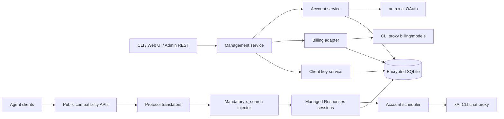

# Implementation Plan

## Goal

在空仓库 `supergrok-api` 中实现单实例 Go Proxy 服务：

- 运营者通过 xAI Grok OAuth 登录多个 SuperGrok / X Premium+ 账号。
- 自动刷新 OAuth token，并将账号持久化到加密 SQLite。
- 在健康账号间按模型执行 round-robin 负载均衡、冷却和故障切换。
- 对下游 agent 提供：
  - `POST /v1/chat/completions`
  - `POST /v1/responses`
  - `POST /v1/messages`
  - `POST /v1/messages/count_tokens`
  - `GET /v1/models`
- 三种生成接口均支持 HTTP 非流式与 SSE 流式响应。
- 所有生成请求默认加入 xAI 原生 `{"type":"x_search"}`；客户端不能关闭。
- 提供 CLI、管理 REST API 和 Web UI 管理账号、usage、模型和下游 API keys。
- 支持代理托管的 `previous_response_id` 多轮会话。
- 默认仅监听 `127.0.0.1`，远程访问交给 Caddy/Nginx/Tailscale 等 TLS 反向代理。

## Confirmed decisions

### 产品边界

- 单租户：全部下游 API keys 共享同一个 xAI 账号池。
- 单实例：SQLite 持久化，不实现多实例协调和分布式锁。
- Web UI 使用 Go 服务端模板和少量原生 JavaScript，不引入 SPA 构建链。
- 下游 API keys 由管理端生成、命名和撤销；只显示一次明文，数据库仅保存哈希。
- OAuth 凭据、托管会话内容和 billing 原始快照均加密保存。
- 管理 REST 使用独立 admin bearer key；Web UI 使用管理员密码、HttpOnly session cookie 和 CSRF 保护。

### API 范围

实现 Agent 核心接口，不实现：

- legacy `POST /v1/completions`
- Responses WebSocket
- `/v1/responses/compact`
- 图片、视频、音频接口
- 多租户账号隔离
- 内置公网 TLS
- OpenAI Responses retrieve/delete 接口
- billing usage 驱动的配额权重调度

### `x_search` 策略

请求翻译为 xAI Responses 格式后统一执行：

1. 已包含 `tools[].type == "x_search"`：保留客户端参数，不重复添加。
2. 未包含：追加 `{"type":"x_search"}`。
3. `tool_choice == "none"`：改为 `"auto"`。
4. 未提供或为 `"auto"`：保持 `"auto"`。
5. 指定某个具体 function/tool 或使用 `"required"`：保留选择，但请求中仍包含 `x_search`。
6. 不提供 Header、请求字段或全局配置关闭该行为。

跨协议结果：

- OpenAI Responses：保留原生 `x_search_call`、annotations、citations 和相关 SSE 事件。
- Chat Completions：输出标准 Chat Completion，只保留最终文本中的 inline citation 链接。
- Anthropic Messages：输出标准 Messages 事件和最终文本；`x_search` 是服务端工具，不伪装为 Anthropic `web_search`，最终 `stop_reason` 为 `end_turn`。
- 不向 Chat/Anthropic 响应加入非标准 `x_search_calls` 或 `citations` 字段。

### 模型策略

- 稳定别名 `grok` 默认解析为 `grok-4.5`。
- 默认 allowlist 包含 `grok-4.5`。
- 管理员可在配置中增加已经验证支持 `x_search` 的模型。
- `/v1/models` 只返回 allowlist 中可路由的模型。
- 模型请求上游时设置实际模型名，并附加 `x-grok-model-override`。
- 模型发现优先使用 OAuth 上游目录，失败时使用本地 allowlist。

### Responses 会话

- `store` 缺省视为 `true`，会话默认保留 30 天。
- `store:false` 不持久化；返回的 response ID 不能用于后续 `previous_response_id`。
- `previous_response_id` 由代理在 SQLite 中解析和重建完整上下文，不依赖 CLI proxy 的服务端状态。
- 会话优先继续使用原账号以利用缓存；原账号不可用时可携带重建上下文切换账号。
- 过期、不存在或 `store:false` 的 ID 返回标准 `previous_response_not_found` 错误。

## Relevant codebase context

### 当前仓库

目标仓库为空，没有需要兼容的既有结构。工作站已安装：

- Go `1.26.4`
- Docker `29.6.1`

项目基线使用 Go 1.26。

### CLIProxyAPI 可抽取部分

参考仓库 `github.com/router-for-me/CLIProxyAPI` 中：

- `internal/auth/xai/types.go`
  - xAI issuer、OIDC discovery、public client ID、scope、默认 API URL 和 CLI chat proxy URL。
- `internal/auth/xai/xai.go`
  - OIDC discovery、RFC 8628 device flow、`authorization_pending`/`slow_down` 轮询、refresh singleflight。
- `internal/auth/xai/token.go`
  - 凭据字段和账号文件命名逻辑。
- `internal/runtime/executor/xai_executor.go`
  - `/responses` 请求、SSE 处理、CLI proxy headers、token refresh、429 cooldown 和工具清理。
- `sdk/cliproxy/auth/selector.go`、`scheduler.go`、`conductor.go`
  - round-robin、账号/模型 cooldown、错误分类和重试。
- `internal/translator/codex/openai/chat-completions`
  - Chat Completions ↔ Responses 转换。
- `internal/translator/codex/openai/responses`
  - Responses 请求规范化和响应透传。
- `internal/translator/codex/claude`
  - Anthropic Messages ↔ Responses 转换。
- `internal/api/server.go`
  - 参考路由：`/v1/chat/completions`、`/v1/responses`、`/v1/messages`、`/v1/messages/count_tokens`、`/v1/models`。

CLIProxyAPI 使用 MIT License。抽取代码时保留版权与许可证声明，不复制无关 provider、插件、Home/Redis、图片、视频和 WebSocket 子系统。

### xAI 官方行为

- xAI Responses API 原生支持 `x_search`，包括 handle/date/image/video filters：  
  https://docs.x.ai/developers/tools/x-search
- `x_search_call` 是 Responses API 的服务端工具输出类型：  
  https://docs.x.ai/developers/tools/tool-usage-details
- Responses 默认提供 inline citations 和结构化 annotations：  
  https://docs.x.ai/developers/tools/citations
- xAI 官方支持 OIDC 和 RFC 8628 device-code 登录：  
  https://docs.x.ai/build/enterprise
- Responses 官方状态保留期为 30 天：  
  https://docs.x.ai/developers/model-capabilities/text/generate-text
- SuperGrok 当前使用跨产品共享的周 usage pool：  
  https://docs.x.ai/grok/faq

### 上游模型和 usage 发现

已观察到：

- 官方 `@xai-official/grok@0.2.99` Linux binary 包含 CLI proxy 的 `/models-v2` 路径、模型目录刷新逻辑和 `supportsBackendSearch` 等模型字段。
- 未认证请求以下路径均返回 401，而不是 404，确认路由存在：
  - `https://cli-chat-proxy.grok.com/v1/models-v2`
  - `https://cli-chat-proxy.grok.com/v1/models`
  - `https://cli-chat-proxy.grok.com/v1/billing?format=credits`
- 官方 binary 当前版本为 `0.2.99`：  
  https://www.npmjs.com/package/@xai-official/grok
- 社区 `pi-grok-cli` 的 billing 实现使用 `/billing` 与 `/billing?format=credits`：  
  https://github.com/kenryu42/pi-grok-cli/blob/main/src/provider/billing.ts

`/models-v2` 和 OAuth billing 均为未公开接口，必须隔离在适配层并允许 schema 演进。

## Recommended approach

### 方案比较

| 方案 | 优点 | 风险/成本 | 结论 |
|---|---|---|---|
| 直接依赖整个 CLIProxyAPI/v7 | 快速获得大量功能 | xAI 关键代码位于 `internal`，外部模块无法直接导入；依赖巨大并带入大量无关 provider 和运行时 | 不采用 |
| 完全重新编写协议转换 | 初始代码边界最干净 | Chat/Responses/Anthropic 的流式、tool call、reasoning、citations 转换很容易产生兼容缺陷 | 不采用 |
| 抽取最小 xAI/OAuth/translator 代码并重构 | 复用已验证行为，同时保持项目专注；可以补齐 `x_search_call` 和安全存储 | 需维护上游差异并保留许可证 | 采用 |

### 总体架构



### 技术选择

- HTTP：Go `net/http`、Go 1.22+ ServeMux method/path patterns。
- 日志：`log/slog`，结构化 request/account ID；默认不记录 prompt 或响应正文。
- SQLite：`modernc.org/sqlite v1.53.0`，纯 Go、无 CGO，启用 WAL、foreign keys 和 busy timeout。
- JSON 兼容转换：`github.com/tidwall/gjson`、`github.com/tidwall/sjson`。
- OAuth：`golang.org/x/oauth2` 配合手动 RFC 8628 device flow；使用 OIDC JWKS 验证 ID token。
- refresh 合并：`golang.org/x/sync/singleflight`。
- token counting：沿用参考项目的 `github.com/tiktoken-go/tokenizer`，明确属于兼容估算，不承诺与 Anthropic 官方计费完全一致。
- Web UI：`html/template`、`embed.FS`、原生 JavaScript。
- 配置：YAML + 环境变量 secret 覆盖。

## Implementation steps

### 1. 初始化模块和目录边界

创建：

```text
cmd/supergrok-api/
internal/
  app/
  config/
  store/
  crypto/
  oauth/xai/
  xai/
  accounts/
  routing/
  models/
  usage/
  sessions/
  search/
  translate/
    registry/
    openai/chatcompletions/
    openai/responses/
    anthropic/
  api/
    middleware/
    openai/
    anthropic/
    admin/
  web/
    templates/
    static/
migrations/
```

`cmd/supergrok-api` 提供：

- `serve`
- `login`
- `version`

`login` 和 Web UI 共用同一 OAuth/account service，不实现第二套登录流程。

### 2. 配置、启动和安全基线

配置内容：

- `server.listen`，默认 `127.0.0.1:8080`
- `data_dir`
- `upstream.cli_proxy_base_url`，默认 `https://cli-chat-proxy.grok.com/v1`
- `upstream.grok_client_version`，默认 `0.2.99`
- `models.default`，默认 `grok-4.5`
- `models.aliases.grok = grok-4.5`
- `models.allowlist`
- 请求总超时、SSE idle timeout、最大 body 大小
- usage refresh interval，默认 5 分钟
- Responses retention，固定默认 30 天

Secret 仅从环境变量或 secret mount 读取：

- `SUPERGROK_MASTER_KEY`：base64 编码的 32-byte 主密钥，缺失时拒绝启动。
- `SUPERGROK_ADMIN_PASSWORD`
- `SUPERGROK_ADMIN_API_KEY`

默认请求 body 上限 16 MiB；Responses 重建链上限 256 个节点和 64 MiB，超过返回 `context_length_exceeded`。

Docker Compose 的端口映射固定为：

```yaml
ports:
  - "127.0.0.1:8080:8080"
```

### 3. SQLite schema 和加密层

迁移表：

- `accounts`
- `account_model_capabilities`
- `account_model_states`
- `oauth_sessions`
- `usage_snapshots`
- `api_keys`
- `response_sessions`
- `admin_sessions`
- `schema_migrations`

使用 HKDF-SHA256 从 master key 派生独立子密钥：

- OAuth credentials
- Responses transcript
- billing raw snapshot
- identity fingerprint
- Web session signing

敏感字段使用 AES-256-GCM，每条记录独立随机 nonce，保存带版本号的 envelope。

账号唯一键使用：

```text
HMAC(identity_key, issuer + "\x00" + subject)
```

避免明文保存 OAuth `sub`。重新登录同一账号时更新现有记录，不创建重复账号。

下游 API key：

- 生成至少 32 bytes 随机值。
- 格式包含可识别 prefix。
- 明文仅创建时返回一次。
- SQLite 保存 SHA-256 hash、prefix、label、created/last-used/revoked 时间。
- bearer 校验使用 constant-time compare。

### 4. xAI OAuth device flow

从 CLIProxyAPI 抽取并强化：

1. 请求 `https://auth.x.ai/.well-known/openid-configuration`。
2. 验证 device/token/JWKS endpoint：
   - 必须 HTTPS。
   - hostname 必须为 `x.ai` 或其子域。
3. 使用参考项目的 public client ID 和 scopes 请求 device code。
4. 返回 user code、verification URL、expiry 和管理端 state。
5. 立即进行第一次 token poll；后续至少间隔 5 秒。
6. 支持：
   - `authorization_pending`
   - `slow_down`：增加 5 秒
   - `expired_token`
   - `access_denied`
   - context cancellation
7. 最大等待时间为 device response expiry 与 30 分钟中的较小值。
8. 使用 OIDC JWKS 验证 ID token 的 signature、issuer、audience、expiry，再读取 email/sub。
9. refresh token 使用 singleflight，避免同账号并发刷新。
10. 在 access token 到期前 5 分钟后台刷新；遇到 401 时同步刷新一次并重试原账号。

OAuth session 保存于 SQLite，因此服务重启后可以恢复尚未过期的轮询状态。

### 5. 上游 xAI Client

统一构造 upstream headers：

- `Authorization: Bearer <access_token>`
- `Content-Type: application/json`
- `Accept: text/event-stream`
- `X-XAI-Token-Auth: xai-grok-cli`
- `x-grok-client-version: 0.2.99`
- `x-grok-model-override: <resolved upstream model>`
- `User-Agent` 使用项目名和版本，不复制用户输入。

所有推理统一请求：

```text
POST https://cli-chat-proxy.grok.com/v1/responses
```

即使下游请求非流式，上游仍设置 `stream:true`：

- 流式下游：边解析边翻译 SSE。
- 非流式下游：消费到 `response.completed` 后生成完整响应。

实现严格 SSE parser，不使用默认 64 KiB Scanner 限制；支持多行 `data:`、空行事件分隔、未知事件透传和 context cancellation。

### 6. 模型发现和 allowlist

账号登录完成、token refresh 成功、服务启动和周期刷新时执行：

1. `GET /models-v2`，附 OAuth/CLI headers。
2. 若返回 2xx：
   - 接受顶层数组或 `{models:[...]}`。
   - 解析 `id`/`model`、name、context window、max completion tokens、reasoning efforts、`supportsBackendSearch`。
   - 保存每账号 capability。
3. `/models-v2` 返回 404 或成功响应不符合可识别 schema 时，尝试 `GET /models`。
4. 401/403 作为账号凭据问题处理，不错误地降级为“目录不可用”。
5. 两个目录都不可用时，保留上次成功快照并标记 stale；无快照时使用本地 allowlist。

最终公开模型集合：

```text
配置 allowlist
∩ 至少一个启用账号可支持的模型
```

当没有任何有效上游目录时，直接公开配置 allowlist；默认包括：

- `grok-4.5`
- 别名 `grok`

调度时只选择已声明支持目标模型的账号；目录未知的账号仍可作为 fallback 候选。

实施时使用真实 OAuth 账号验证 `/models-v2` 响应 schema，并把脱敏响应保存为测试 fixture。验收要求 `grok-4.5` 通过 OAuth CLI proxy 成功执行一次原生 `x_search`；未通过前不将功能标记为完成。

### 7. 协议转换层

从 CLIProxyAPI 抽取最小 translator registry 和以下转换：

- OpenAI Chat Completions → xAI Responses
- xAI Responses → OpenAI Chat Completions
- OpenAI Responses → xAI Responses
- xAI Responses → OpenAI Responses
- Anthropic Messages → xAI Responses
- xAI Responses → Anthropic Messages

保留：

- system/developer/user/assistant 消息
- multimodal text/image input 的兼容转换
- client-side function calls/results
- reasoning summary
- usage token 字段
- stream/non-stream
- stop reason
- tool name 长度兼容

删除参考项目中与 Gemini、Codex auth、Antigravity、图片生成、compaction、WebSocket、plugin hooks 有关的代码。

补充 `x_search_call` 行为：

- Responses translator：完整透传。
- Chat translator：忽略服务端调用过程事件，但保留最终输出文本、usage 和 inline citations。
- Anthropic translator：忽略不需要客户端执行的 `x_search_call` 过程事件；不生成 `tool_use`；最终文本正常输出，`stop_reason=end_turn`。
- 未知 xAI server-side tool event 不得导致流中断。

### 8. 强制 `x_search` 注入

在所有协议翻译成 canonical Responses body 后调用单一 `search.Inject`：

- 遍历 tools，避免重复。
- 保留客户端已经提供的 x_search filters：
  - `allowed_x_handles`
  - `excluded_x_handles`
  - `from_date`
  - `to_date`
  - `enable_image_understanding`
  - `enable_video_understanding`
- 未提供时追加无 filters 的 `{"type":"x_search"}`。
- 将 `tool_choice:"none"` 重写为 `"auto"`。
- 不加入 `no_inline_citations`。
- 不修改明确选择的其他具体 function/tool。
- 清理仅在 tools 为空时才有意义的无效 `parallel_tool_calls` 状态，但注入后 tools 永远非空。

在 upstream request 发送前增加 invariant check：不存在 x_search 时直接返回内部错误，防止未来 translator 绕过注入层。

### 9. 代理托管 Responses 会话

`response_sessions` 每个节点保存：

- downstream/upstream response ID
- previous response ID
- resolved model
- account ID
- 加密 canonical request input
- 加密 terminal response output
- created/expiry
- store 标志

新请求含 `previous_response_id` 时：

1. 校验 ID 存在、未过期、属于同一单租户服务。
2. 沿 previous 链反向读取，检测循环并执行节点/大小限制。
3. 反转为时间顺序。
4. 合并历史 request input 和 response output items。
5. 保留有效的：
   - message
   - function_call
   - function_call_output
   - reasoning summary/encrypted content
6. 追加当前 input。
7. 删除传往 HTTP CLI proxy 的 `previous_response_id`。
8. 上游设置 `store:false`，由本服务负责持久化。
9. 优先使用上一节点账号；账号不可用时由 scheduler failover。

每小时清理：

- 过期 Responses session
- 过期 OAuth device session
- 过期 Web admin session
- 超过 retention 的 usage raw snapshots

### 10. 多账号路由和错误处理

默认按 resolved model 维护独立 round-robin cursor。

候选条件：

- enabled
- OAuth token 可用或可刷新
- 账号/model 不在 cooldown
- 已知 capability 支持目标模型，或 capability 当前未知

单请求最多尝试每个候选账号一次。

错误策略：

| 情况 | 行为 |
|---|---|
| 400/404 模型或 payload 错误 | 不切账号；直接返回客户端错误 |
| 401 | 同账号刷新 token 并重试一次；仍失败则账号 invalid 并切换 |
| `invalid_grant` | 禁用账号，需要重新 OAuth 登录 |
| 429 + Retry-After | 按 Retry-After 冷却对应账号/model |
| `subscription:free-usage-exhausted` | 优先使用 billing reset；缺失时按参考逻辑冷却 24 小时 |
| 普通 429 | 指数 cooldown，1 分钟起，最大 30 分钟 |
| 408/500/502/503/504 | 60 秒 transient cooldown，并尝试下一账号 |
| 明确的连接建立失败 | 尝试下一账号 |
| 客户端取消 | 立即取消 upstream，不切账号 |

Usage 快照只用于展示，不直接决定路由；billing 可能 stale，且 Extra Usage Credits 会使“100% weekly used”不一定等同于完全不可用。实际 429 是 cooldown 的权威信号。

流式故障切换边界：

- 在向下游写入 headers/首个事件前，验证 upstream 为 2xx 并取得第一个合法 SSE 事件。
- 首事件前失败可换账号。
- 首个事件写出后不得换账号，避免重复文本、重复 tool call 和重复计费；只关闭流或发送协议允许的 error event。

### 11. Usage adapter

每账号后台每 5 分钟刷新一次，管理端支持强制刷新。

请求：

- `/billing?format=credits`：周 usage、reset、on-demand/prepaid 字段。
- `/billing`：若可用，获取 monthly limit、used、remaining、reset。

解析使用显式 schema 校验；原始 JSON 加密保存以便上游 schema 变化时排查。

统一返回：

```json
{
  "account_id": "...",
  "label": "...",
  "monthly": {
    "limit": 0,
    "used": 0,
    "remaining": 0,
    "reset_at": "..."
  },
  "weekly": {
    "used_percent": 0,
    "remaining_percent": 100,
    "reset_at": "..."
  },
  "local": {
    "requests": 0,
    "input_tokens": 0,
    "output_tokens": 0,
    "failures": 0
  },
  "fetched_at": "...",
  "stale": false,
  "error": null
}
```

规则：

- 上游失败但有历史快照：返回快照并设置 `stale:true`。
- 无快照：相关字段为 `null`，状态为 `unknown`。
- usage 刷新失败不得影响推理请求。
- 不对各账号的 weekly percentage 做错误求和；Web UI 按账号展示。

### 12. Public API 和错误契约

公开路由：

```text
GET  /healthz
GET  /readyz
GET  /v1/models
POST /v1/chat/completions
POST /v1/responses
POST /v1/messages
POST /v1/messages/count_tokens
```

Bearer middleware：

- 只接受管理端创建且未撤销的 client key。
- `/healthz` 不鉴权。
- `/readyz` 不泄露账号详情，只返回是否存在可服务默认模型的健康账号。

错误格式：

- OpenAI 路由使用 OpenAI `error` object。
- Anthropic 路由使用 Anthropic `{type:"error", error:{type,message}}`。
- cooldown 返回 HTTP 429 和 `Retry-After`。
- 不向下游暴露 upstream OAuth token、账号 email、原始 billing body 或内部 SQLite 错误。

### 13. 管理 REST API

使用 `/admin/api/v1`：

```text
POST   /oauth/xai/device
GET    /oauth/xai/device/{state}
DELETE /oauth/xai/device/{state}

GET    /accounts
PATCH  /accounts/{id}
DELETE /accounts/{id}
POST   /accounts/{id}/refresh
GET    /accounts/{id}/usage
POST   /accounts/{id}/usage/refresh

GET    /usage
GET    /models
POST   /models/refresh

GET    /api-keys
POST   /api-keys
DELETE /api-keys/{id}
```

账号 PATCH 只允许修改 label 和 enabled；不允许通过 API 写入 token。

删除账号时：

- 删除凭据和 capability/cooldown 状态。
- 已保存的 Responses 会话仍可通过完整 transcript 在其他账号重建。
- 若无其他可用账号，后续 continuation 返回 provider unavailable，而不是丢失会话内容。

### 14. Web UI

页面：

- `/admin/login`
- `/admin/`
- `/admin/accounts`
- `/admin/accounts/{id}`
- `/admin/oauth/new`
- `/admin/usage`
- `/admin/models`
- `/admin/api-keys`

OAuth 页面：

1. 启动 device flow。
2. 显示 verification URL、user code 和 expiry。
3. 原生 JavaScript 轮询状态。
4. 完成后跳转账号详情。
5. 支持取消。

安全：

- 登录成功后创建随机服务端 session。
- Cookie：HttpOnly、SameSite=Strict；经可信反代 HTTPS 时设置 Secure。
- 所有 mutation 使用 CSRF token。
- 管理 API key 不写入浏览器 localStorage。
- 删除账号和撤销 API key 需要确认。
- 页面不显示 access/refresh token。

### 15. Docker 和运行时

创建 multi-stage Dockerfile：

- builder：Go 1.26
- runtime：非 root 用户、最小 CA/runtime image
- `/data` 持久卷
- 容器内监听 `0.0.0.0:8080`
- Compose 只发布到宿主机 `127.0.0.1:8080`

健康检查调用 `/healthz`；readiness 用于确认至少有一个可用账号和默认模型。

优雅关闭：

- 停止接受新请求。
- 取消 OAuth poll、usage refresh 和 upstream 请求。
- 给活动 SSE 流有限 drain 时间。
- checkpoint SQLite WAL 后退出。

## Validation plan

### 单元测试

1. **OAuth**
   - discovery endpoint 拒绝 HTTP 和非 x.ai host。
   - device request 的 client ID/scope 正确。
   - pending、slow_down、denied、expired 和 cancellation。
   - refresh singleflight。
   - ID token signature/issuer/audience/expiry 验证。

2. **加密存储**
   - 数据库中不存在明文 token、prompt 或 API key。
   - 错误 master key fail closed。
   - nonce 不复用。
   - migration 可从空库和上一 schema 升级。
   - 重启后账号、cooldown、usage 和会话恢复。

3. **模型发现**
   - `/models-v2` 顶层数组和 `{models:[]}`。
   - `/models-v2` schema 不兼容时回退 `/models`。
   - 401 不被误判为目录缺失。
   - allowlist、alias、account capability 交集正确。

4. **`x_search` invariant**
   - 三种协议均在 canonical upstream body 中包含 x_search。
   - 已有 x_search 不重复。
   - filters 原样保留。
   - `tool_choice:none` 改为 auto。
   - 具体 function/tool choice 保留。
   - translator 未来绕过注入时测试失败。

5. **协议转换**
   - Chat 和 Anthropic 的 stream/non-stream。
   - client-side tool call/result。
   - `x_search_call` 不被错误暴露为客户端 tool call。
   - Responses 保留原生 x_search 事件、annotations 和 citations。
   - Chat/Anthropic 保留 inline citation 文本。
   - Anthropic `stop_reason=end_turn`。

6. **Responses 会话**
   - 单轮、多轮、function output 和 reasoning replay。
   - `store:false` 不可 continuation。
   - 30 天过期。
   - unknown/expired ID 返回标准错误。
   - 原账号 cooldown 后使用其他账号重建。
   - 节点/大小/cycle 限制。

7. **调度**
   - 并发 round-robin 无数据竞争。
   - 模型能力筛选。
   - 401 refresh 后同账号重试。
   - 429/5xx cooldown 和恢复。
   - 单请求不重复尝试同账号。
   - cooldown 重启恢复。

8. **Usage**
   - monthly/weekly 两种 schema。
   - 缺字段、类型变化和非 2xx。
   - stale fallback。
   - billing 失败不影响推理。

### 集成测试

使用 `httptest.Server` 模拟完整 xAI：

- OIDC discovery、device、token、refresh、JWKS。
- `/models-v2`、`/models`。
- `/billing` 和 `/billing?format=credits`。
- `/responses` SSE：
  - `response.created`
  - `x_search_call`
  - output text delta
  - annotations/citations
  - usage
  - `response.completed`
- 两账号场景：round-robin、401、429、5xx、首事件前断流和首事件后断流。

对五个公开 API 做端到端 HTTP 测试，验证：

- bearer auth
- content type
- SSE event 顺序
- `[DONE]` 仅出现在 Chat Completions 所需位置
- disconnect cancellation
- 标准错误格式
- 不泄露账号信息

Web UI 测试：

- 登录、session expiry、CSRF。
- device flow polling。
- API key 创建仅一次返回明文。
- 撤销 key 后立即 401。
- 账号启停和删除。

### 实际 OAuth 验收

用至少两个真实账号完成：

1. CLI 登录账号 A。
2. Web UI 登录账号 B。
3. 两个账号自动获取模型目录和 billing usage。
4. `/v1/models` 返回 `grok` 与 `grok-4.5`。
5. 分别通过 Chat、Responses、Anthropic 发起需要实时 X 信息的问题。
6. 检查 upstream body 确实含 `x_search`。
7. Responses 返回原生 x_search/citation 信息。
8. Chat/Anthropic 文本包含 inline citation 链接。
9. 连续请求在两个账号间轮转。
10. 禁用账号 A 后全部请求走账号 B。
11. 模拟账号 B 429，验证 A 接管及 `Retry-After`。
12. 重启服务，确认账号、usage、client keys、cooldown 和 Responses continuation 均恢复。
13. 检查 SQLite 和日志中不存在明文 token/API key/prompt。

## Risks and mitigations

### 1. 消费者 OAuth 代理的条款和账号风险

使用 SuperGrok/X Premium+ OAuth 作为通用 agent API proxy 可能受到 xAI 产品条款、配额策略或反滥用规则限制。

缓解：

- 管理 UI 明示这是 OAuth CLI proxy，而非官方 API key billing。
- 不绕过服务端限流或账号封禁。
- 尊重 401/403/429 和 cooldown。
- 不伪造无限账号或并发。
- 部署前由运营者确认 xAI 当前条款允许目标用途。

### 2. 未公开 endpoint 和 schema 演进

`/models-v2`、`/billing`、CLI headers 可能随官方 CLI 更新。

缓解：

- 模型、billing 和 inference header profile 集中在 `internal/xai`。
- `grok_client_version` 配置化，默认固定到已观察的 `0.2.99`。
- 严格 schema 校验，保存加密原始快照。
- 保留上次成功数据并标记 stale。
- `/models-v2` → `/models` → allowlist 有明确降级顺序。
- 建立脱敏 fixture 和 contract tests。
- 升级官方 Grok CLI 版本时先运行兼容测试再修改默认 client version。

### 3. OAuth client ID、scope 或登录策略变化

参考项目中的 public client ID/scope 可能被 xAI 更新或限制。

缓解：

- OIDC endpoint 动态 discovery。
- client ID/scope 集中管理并允许部署配置覆盖。
- device flow 失败必须显示 upstream OAuth error，不回退到不安全的网页登录 token 抓取。
- release 验收包含真实 device flow 和 refresh。

### 4. OAuth CLI proxy 对 `x_search` 的支持可能按账号/模型灰度

官方 API 文档确认 `grok-4.5` 支持 x_search，但 OAuth CLI proxy 的 entitlement 可能因计划、地区和 rollout 不同。

缓解：

- 获取每账号 model capability。
- 模型目录中的 `supportsBackendSearch` 进入调度约束。
- 默认模型在发布前执行真实 OAuth x_search 验收。
- `/readyz` 在没有可服务默认模型的账号时返回 not ready。
- 管理 UI 显示每账号模型/搜索 capability 和最后验证时间。

### 5. SSE 中途失败无法安全换账号

首 token 后换账号会重复输出、重复工具调用或产生语义分叉。

缓解：

- 首事件前允许 failover。
- 首事件后禁止 failover。
- 下游收到明确断流，而不是透明重复。
- 流式测试覆盖首事件前后两个边界。

### 6. 托管会话包含敏感 prompt 和模型输出

支持 `previous_response_id` 必须本地保存上下文。

缓解：

- AES-GCM 加密。
- 30 天自动清理。
- `store:false` 严格不持久化。
- 日志不记录正文。
- body/链深/总大小限制。
- 默认仅本机监听。
- 数据卷备份必须与 master key 分开存储。

### 7. 协议转换随上游事件变化

新的 xAI server-side tool event 可能破坏 Chat/Anthropic 转换。

缓解：

- Responses 原生事件默认透传。
- Chat/Anthropic 忽略未知 server-side call 事件，但继续处理文本和 terminal event。
- 对 event ordering、stop reason、citations 和 usage 建立 fixture tests。
- 抽取代码保留来源注释，便于定期与 CLIProxyAPI 对比更新。
